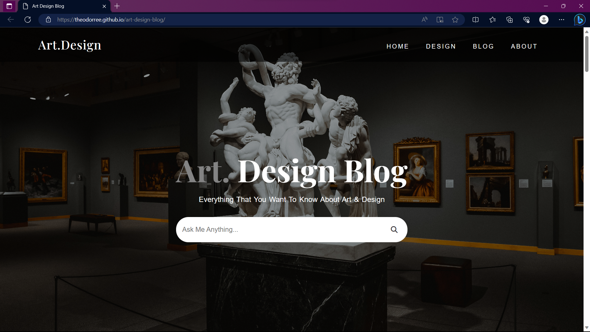

# Art Design Blog

## Description

Art Design Blog is a web application that showcases various art and design articles, tutorials, and creative inspirations. The project aims to provide a platform for artists, designers, and enthusiasts to share their work and ideas with the community.

## Features

- Browse art
- Share creative inspirations and work with the community.

## Technologies Used

- HTML
- CSS

## Demo

You can see a live demo of the project [here](https://theodorree.github.io/art-design-blog/)
